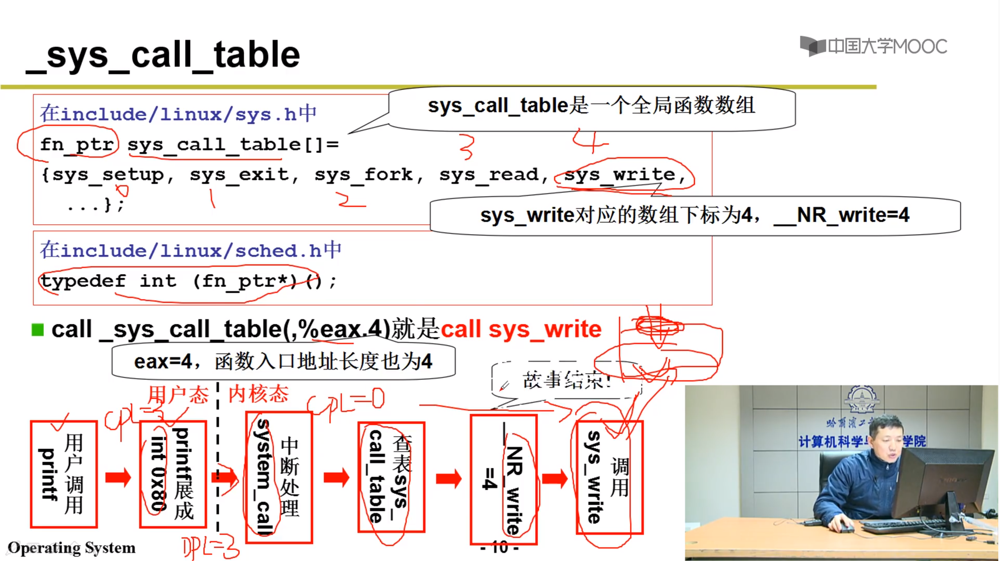
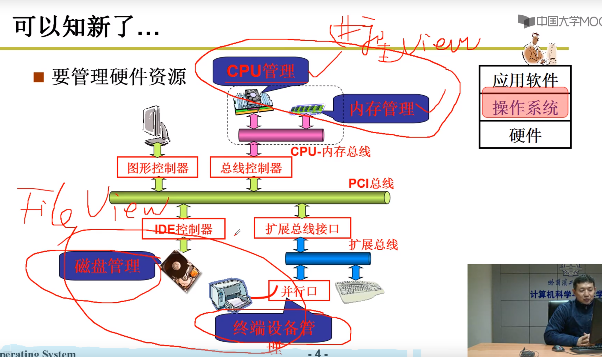
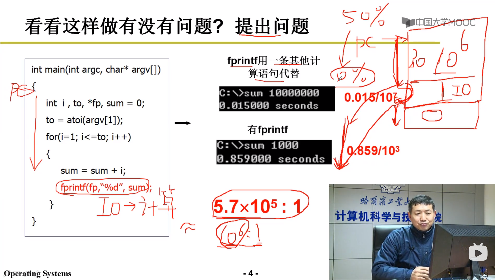
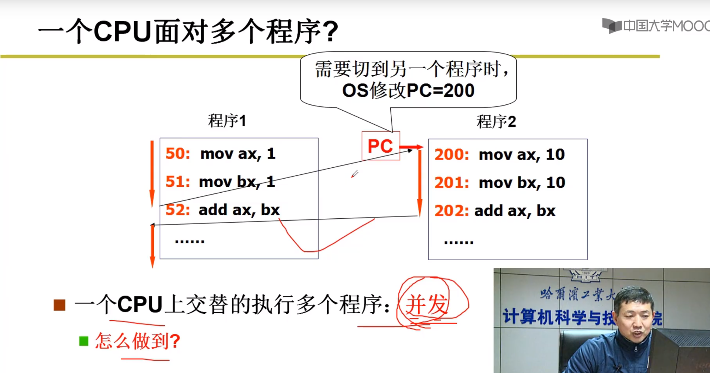

# 操作系统

## L1.什么是操作系统

没有操作系统


CPU发出指令,将内存300位置的数据送到显存中,然后显示`hello`

有操作系统


```c++
printf("hello");
```

**操作系统:是计算机硬件和应用之间的一层软件**


**`Learn OS concepts by coding them`**

## L2.开始揭开钢琴的盒子


这个黑色背后发生了什么?

1. 打开电源，计算机开始工作了

2. 计算机怎么工作的？-->**图灵机**-->**通用图灵机**--->计算机

   

**只会做加法**


**取值执行**

3. 打开电源，计算机执行的第一句指令是什么？

   

   0磁道0扇区就是引导扇区,512个Byte

   

4. 引导扇区(汇编代码) **bootsect.h**

   

   

   

   

以上是将代码从磁盘读入.

## L3.操作系统启动


 


**setup.s完成的事情：**

1. 读了硬件参数，为建立操作系统打下基础
2. 将System的代码挪到0地址处，核心代码一直存在这。
3. 开启了保护模式
4. 跳转到0地址处执行System代码


从head.s 跳转到 main.c (从汇编到C)


men_init 内存初始化 


## L4.操作系统接口


什么是操作系统接口：连接上层用户和操作系统软件


**操作系统接口：系统调用**


 

## L5.系统调用的实现

**为什么不能直接访问？**


DPL:目标内存段的特权级

CPL:当前内存段的特权级

数字越大等级越低，数字越小等级越高

**怎么做到的不能直接访问？**


**不直接访问，那怎么办？**

中断是进入内核的唯一方法





## L6.操作系统历史


 


## L7.我们的学习任务




## L8.CPU管理的直观想法

多进程怎么引出来的？

**操作系统的核心就是管理计算机硬件，CPU是计算机最主要的硬件，首先就是要管理CPU，就是在管理CPU的时候才引出了多进程图像。**


**怎么管理CPU：设置好PC的初值就行了**



**如果CPU停下来等IO，那么CPU的利用率将会大大降低，此时CPU应该去做别的事情，等IO传输完毕之后，再回来继续这段程序。**


**多个程序在内存中：多道程序**


**一个CPU上交替的执行多个程序：`并发`**



切换PC，指向不同代码段


**运行中的程序就是进程**


## L9.多进程图像


**看一下自己计算机的进程：任务管理器**

**用户使用计算机就是启动了一系列的进程，OS管理计算机就是管理一系列进程**


**多个进程如何组织？多个进程的所对应的PCB分别放在不同的地方**


**进程通过状态来分类**

**操作系统通过使进程的状态发生变化从而推进进程**


 


## L10.用户级线程


**线程的切换：是指令之间的切换，资源没有切换**


 


**核心级线程并发性更好一些**


## L11.内核级线程


 


